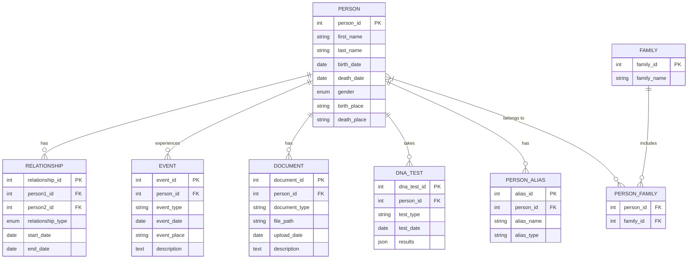

# Family Tree Application Database Design

## Overview

This document outlines the database design for our Family Tree Application. The design focuses on flexibility, scalability, and the ability to represent complex family relationships and historical data.

## Entity-Relationship Diagram

## Table Descriptions

### 1. PERSON

The core table of our database, storing essential information about individuals.

| Column Name | Data Type | Constraints | Description |
|-------------|-----------|-------------|-------------|
| person_id   | INT       | PRIMARY KEY | Unique identifier for each person |
| first_name  | VARCHAR(50) | NOT NULL  | First name of the person |
| last_name   | VARCHAR(50) | NOT NULL  | Last name of the person |
| birth_date  | DATE      |             | Date of birth |
| death_date  | DATE      |             | Date of death (if applicable) |
| gender      | ENUM      |             | Gender of the person |
| birth_place | VARCHAR(100) |           | Place of birth |
| death_place | VARCHAR(100) |           | Place of death (if applicable) |

### 2. RELATIONSHIP

Represents various types of relationships between individuals.

| Column Name | Data Type | Constraints | Description |
|-------------|-----------|-------------|-------------|
| relationship_id | INT   | PRIMARY KEY | Unique identifier for each relationship |
| person1_id | INT        | FOREIGN KEY | ID of the first person in the relationship |
| person2_id | INT        | FOREIGN KEY | ID of the second person in the relationship |
| relationship_type | ENUM | NOT NULL   | Type of relationship (e.g., parent-child, spouse, sibling) |
| start_date | DATE       |             | Start date of the relationship |
| end_date   | DATE       |             | End date of the relationship (if applicable) |

### 3. EVENT

Stores significant life events for each person.

| Column Name | Data Type | Constraints | Description |
|-------------|-----------|-------------|-------------|
| event_id    | INT       | PRIMARY KEY | Unique identifier for each event |
| person_id   | INT       | FOREIGN KEY | ID of the person associated with the event |
| event_type  | VARCHAR(50) | NOT NULL  | Type of event (e.g., birth, death, marriage, graduation) |
| event_date  | DATE      | NOT NULL    | Date of the event |
| event_place | VARCHAR(100) |           | Place where the event occurred |
| description | TEXT      |             | Additional details about the event |

### 4. DOCUMENT

Manages documents and media associated with individuals.

| Column Name | Data Type | Constraints | Description |
|-------------|-----------|-------------|-------------|
| document_id | INT       | PRIMARY KEY | Unique identifier for each document |
| person_id   | INT       | FOREIGN KEY | ID of the person associated with the document |
| document_type | VARCHAR(50) | NOT NULL | Type of document (e.g., photo, certificate, letter) |
| file_path   | VARCHAR(255) | NOT NULL  | Path to the stored file |
| upload_date | DATE      | NOT NULL    | Date the document was uploaded |
| description | TEXT      |             | Description of the document |

### 5. DNA_TEST

Stores information about genetic testing.

| Column Name | Data Type | Constraints | Description |
|-------------|-----------|-------------|-------------|
| dna_test_id | INT       | PRIMARY KEY | Unique identifier for each DNA test |
| person_id   | INT       | FOREIGN KEY | ID of the person who took the test |
| test_type   | VARCHAR(50) | NOT NULL  | Type of DNA test |
| test_date   | DATE      | NOT NULL    | Date the test was taken |
| results     | JSON      |             | Flexible storage for various test results |

### 6. PERSON_ALIAS

Handles alternative names or spellings for individuals.

| Column Name | Data Type | Constraints | Description |
|-------------|-----------|-------------|-------------|
| alias_id    | INT       | PRIMARY KEY | Unique identifier for each alias |
| person_id   | INT       | FOREIGN KEY | ID of the person associated with the alias |
| alias_name  | VARCHAR(100) | NOT NULL | Alternative name or spelling |
| alias_type  | VARCHAR(50) |           | Type of alias (e.g., nickname, maiden name) |

### 7. FAMILY

Allows grouping of individuals into families.

| Column Name | Data Type | Constraints | Description |
|-------------|-----------|-------------|-------------|
| family_id   | INT       | PRIMARY KEY | Unique identifier for each family |
| family_name | VARCHAR(100) | NOT NULL | Name of the family |

### 8. PERSON_FAMILY

Junction table to associate persons with families.

| Column Name | Data Type | Constraints | Description |
|-------------|-----------|-------------|-------------|
| person_id   | INT       | FOREIGN KEY | ID of the person |
| family_id   | INT       | FOREIGN KEY | ID of the family |

## Implementation Considerations

1. **Indexing**: Create indexes on frequently queried fields, such as names and dates, to improve query performance.

2. **Constraints**: Implement foreign key constraints to maintain referential integrity across tables.

3. **Stored Procedures**: Develop stored procedures for complex operations like calculating relationships or generating family trees.

4. **Views**: Create views for commonly used data combinations to simplify querying.

5. **Partitioning**: For large datasets, consider table partitioning to improve query performance and manageability.

6. **Auditing**: Implement an auditing system to track changes to sensitive data, ensuring data integrity and supporting historical analysis.

7. **Encryption**: Use column-level encryption for sensitive information to enhance data security.

8. **Scalability**: Design the database with future growth in mind, allowing for easy expansion of data types and relationships.

## Conclusion

This database design provides a robust foundation for our Family Tree Application. It offers flexibility in representing complex family relationships, supports various types of historical data, and allows for future expansion. Regular review and optimization of the database structure and queries will ensure optimal performance as the application grows.
